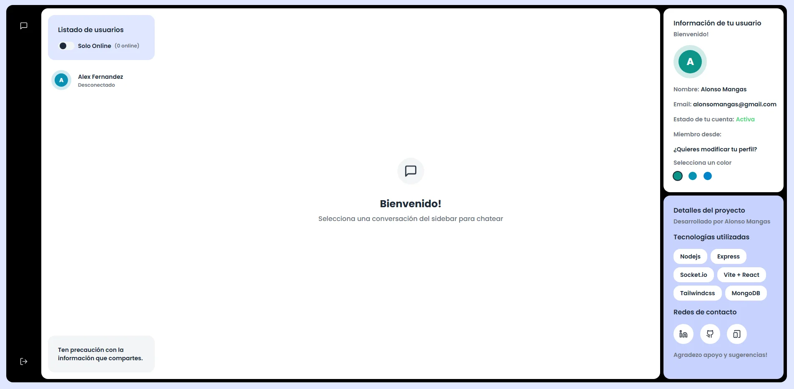

# say


## Descripción
Bienvenido a Say! Conecta con otros usuarios en tiempo real y mantén conversaciones en vivo con ellos.

Se trata de una aplicación fullstack desarrollada utilizando el stack MERN, implementando Socket.io y TailwindCSS, entre otros. He buscado una interfaz minimalista y moderna, acompañada de una experiencia de usuario rápida e intuitiva.

## Tecnologías utilizadas

-  Stack tecnológico: MERN (MongoDB, Express, React, Node.js) + Socket.io + TailwindCSS + Daisy UI (solo para el bubble del chat, lo demás lo he personalizado a mi gusto).
-  Autenticación y Autorización: Implementación segura utilizando JWT.
-  Chat en tiempo real: Comunicación instantánea implementada mediante websockets (Socket.io).
-  Estado de Usuarios en Línea: Seguimiento del estado de conexión de los usuarios en tiempo real.
-  Despliegue en Render cloud.

---

## Configuración inicial

1. Crea un archivo `.env` en el directorio principal del proyecto con el siguiente contenido:

   ```env
   MONGODB_URI=...
   PORT=5001
   JWT_SECRET=...
   NODE_ENV=development
   ```

   Completa los valores con tus keys.

---

## Construir la aplicación

Para construir la aplicación, ejecuta el siguiente comando:

```bash
npm run build
```

---

## Iniciar la aplicación

Para iniciar la aplicación en modo producción:

```bash
npm start
```

---


Agradezco mucho sugerencias!

